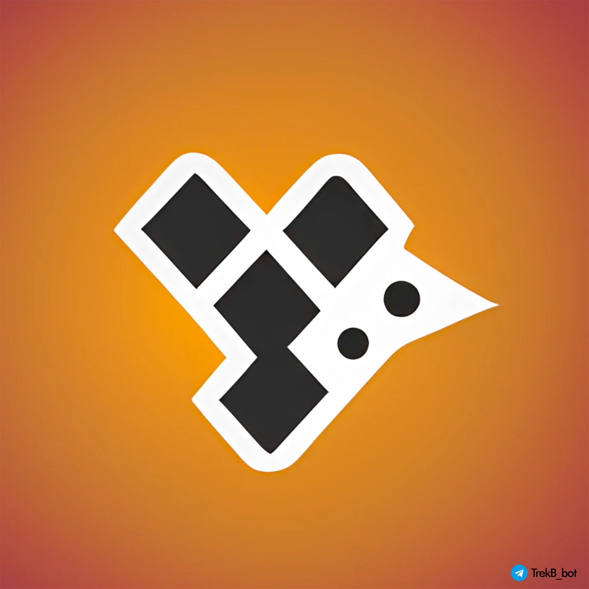

# TrekB
### *Smart Portfolio Tracker*

A bot powered by modern data engineering and infrastructure solutions,\
designed to allow easy performance tracking of your digital assets\
via simple Telegram interfaces. **Try it out yourself:**

## Repository Organization:

    ├── README.md               <- Project README
    ├── Bot                     <- Core Telegram "front-end" component of the project 👨‍💻
        ├── branch: main            <- MVP runner with some basic features ✔️
        └── branch: placeholder     <- Interim runner while main is in DEV ✔️
    ├── Airflow                 <- Airflow dags, queries & setup 👨‍💻
    └── Misc                    <- Miscellaneous objects

[About](#about) •
[Capabilities](#capabilities) •
[Architecture](#architecture) •
[Scaling](#scaling) •
[Takeaways](#takeaways) •
[Links](#links)

## About

To be updated ...

## Capabilities
    
<ins>Implemented</ins>

    • [LITE]: add, edit & delete individual asset records in portfolio
    
<ins>Upcoming</ins>

    • [VM]: improved portfolio navigation
    • [VM]: import crypto wallet balance & history into portfolio

## Architecture

### [LITE]

MVP version of the project which enables users to manage their asset portfolios.

<ins>Tech Features</ins>

    • asynchronous I/O
    • DB* keeps users' info & handles portfolio management
    • Redis caching is used to optimize DB* querying
    • users' input data is validated with pydantic
    • DB* querying performance & users' actions are logged to either CLI, local folder or logging service
    
      * DB - transactional DB (SQLite in [LITE] & PostgreSQL in [VM])
    
<ins>High-Level Overview</ins>

<ins>Screenshots</ins>

Stack: `SQLite`, `Redis`, `Python`, `SQL`, `Docker`

---

### [VM]

Main version of the projects which enables users to gain insights on their portfolios.

<ins>Tech Features</ins>

    Everything from [LITE] plus:
    • 

<ins>High-Level Overview</ins>

Stack: `ClickHouse`, `PostgreSQL`, `Redis`, `Apache Kafka`, `Apache Airflow`, `S3`, `Docker Compose`, `Python`, `SQL`

<ins>Data Pipelines</ins>

Tags: `tag1`

<ins>DB Tables</ins>

<ins>Docker Layers</ins>

<ins>CI/CD Component</ins>

---

## Scaling

To be updateted ...

## Takeaways

To be updateted ...

## Links

Libraries:
[`aiogram`](https://github.com/aiogram/aiogram),
[`asyncio`](https://github.com/python/asyncio),
[`aiosqlite`](https://github.com/omnilib/aiosqlite),
[`SQLAlchemy`](https://github.com/sqlalchemy/sqlalchemy),
[`pydantic`](https://github.com/pydantic/pydantic),
[`redis`](https://github.com/redis/redis),
[`aioredis`](https://github.com/aio-libs/aioredis-py)

Projects:
[`SQLite`](https://sqlite.org/index.html),
[`Redis`](https://redis.io/),
[`Docker`](https://www.docker.com/)

Designed & Developed by: [@dmitriidavs](https://www.linkedin.com/in/dmitriidavs/)

